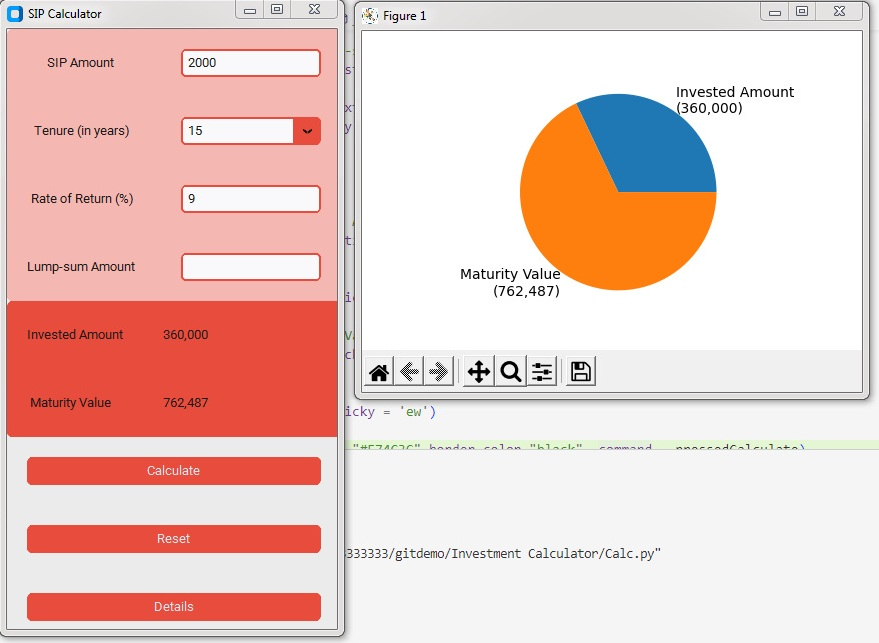

<!--Please do not remove this part-->


# Investment Calculator

<!-- Add a jpeg/png/gif file here if applicable -->

<!--An image is an illustration for your project, the tip here is using your sense of humour as much as you can :D 

You can copy paste my markdown photo insert as following:
<p align="center">

-->

<p align="center">


## 🛠️ Description
<!--Remove the below lines and add yours -->
This project presents an investment calculator built using Python and the customtkinter library, designed to facilitate financial planning through a user-friendly graphical interface. The calculator allows users to input their SIP (Systematic Investment Plan) amount or lump sum amount, specify the investment tenure in years, and provide the expected rate of return. Upon clicking the 'Calculate' button, the invested amount, maturity value is displayed.

## ⚙️ Languages or Frameworks Used
<!--Remove the below lines and add yours -->
Language: Python

Modules :

        tkinter
        customtkinter
        numpy
        matplotlib
    

## 🌟 How to run
<!--Remove the below lines and add yours -->
Step-1: Install required modules
```sh
pip install customtkinter
```
```sh
pip install numpy
```
```sh
pip install matplotlib
```
Step-2: Run the program

Optional: In order to use this project as an application on your desktop:

Step 1 : 
```sh
pip install pyinstaller
```
Step 2 :
Make a Folder on your Desktop
and move the Calc.py file in the folder

Step 3 : Open any command line interface and enter that respective folder using the cd command

Step 4 : Execute the following command :

```sh
pyinstaller -F -w Calc.py
```
This will create a .exe file in that folder which can be used as an application
## 📺 Demo
<p align="center">


## 🤖 Author
<!--Remove the below lines and add yours -->
Aditya Mohite
