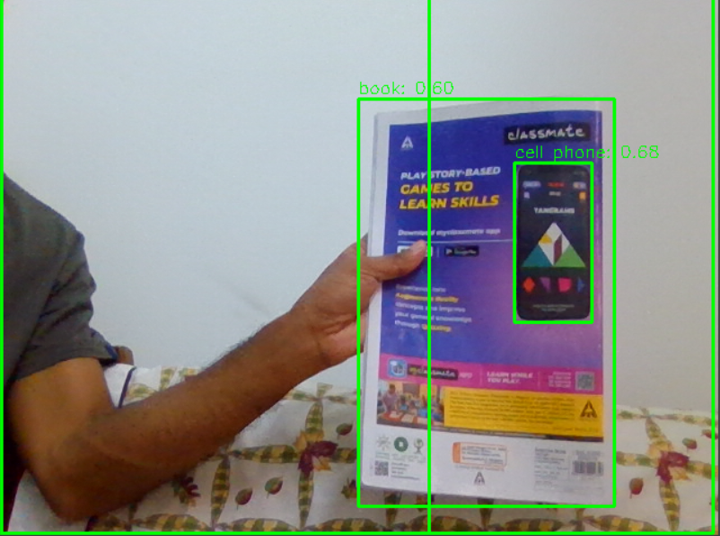

# Object Detection


## 🛠️ Description

This folder contains a Python script for a real-time object detection application using the YOLOv9 model from Ultralytics. The application uses the default camera (webcam) for video input and displays detected objects with bounding boxes, including labels of the detected object and their probability.

## ⚙️ Languages or Frameworks Used

Open Command Prompt and use the following command to install the required modules:
``` bash
pip install -r requirements.txt
```

## 🌟 How to run

You can run the program using the following command
``` bash
python object-detection.py
```

## 📺 Demo
<p align="center">


## 🤖 Author

[Kevin Cherian George](https://github.com/kevin-291)
