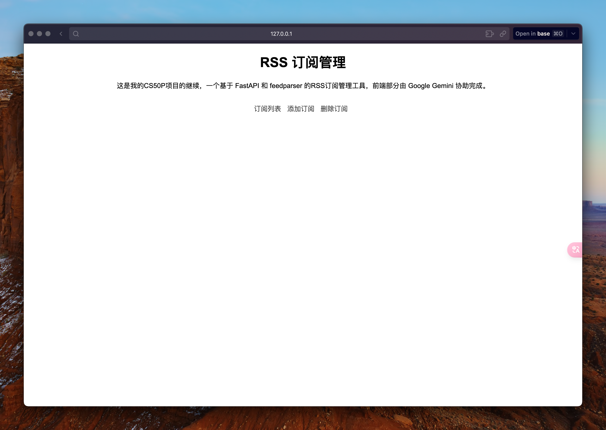
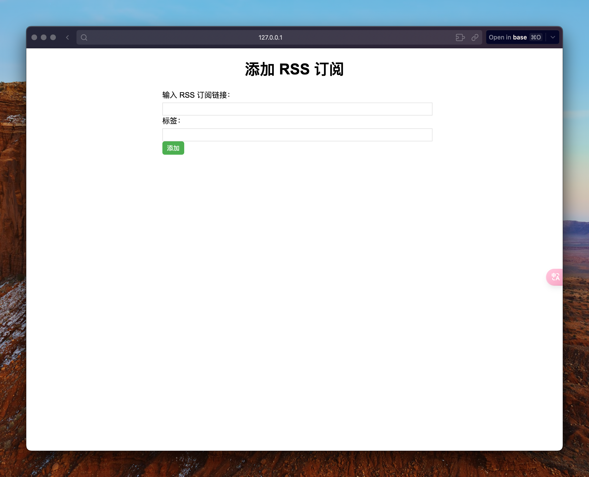
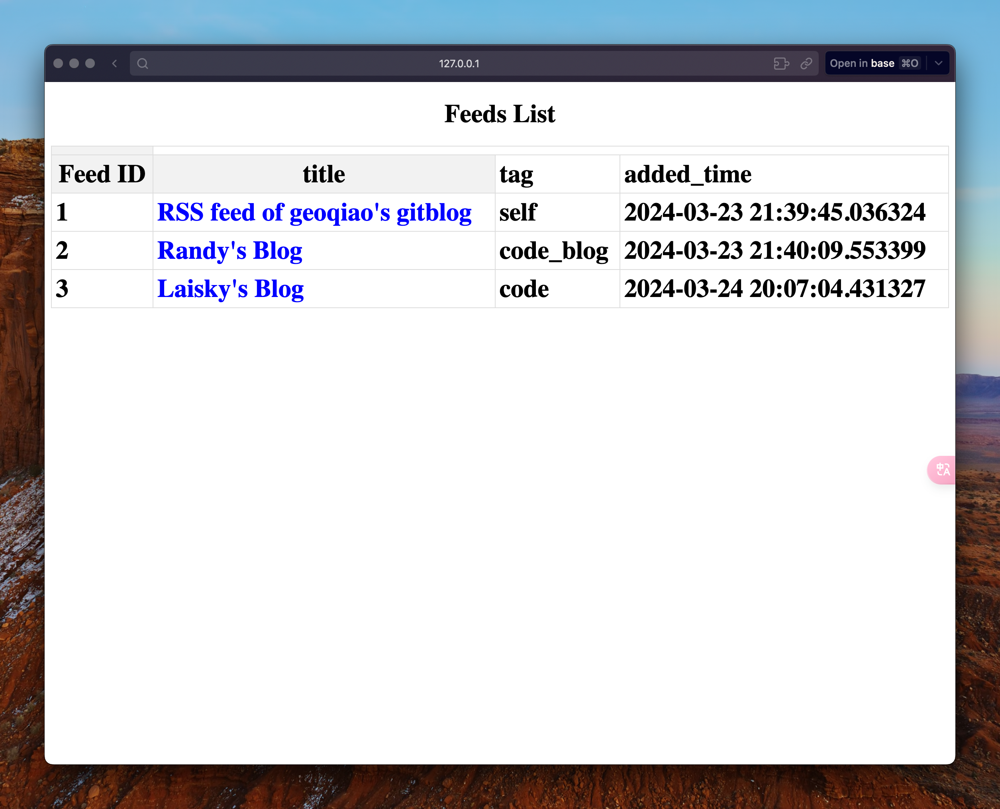
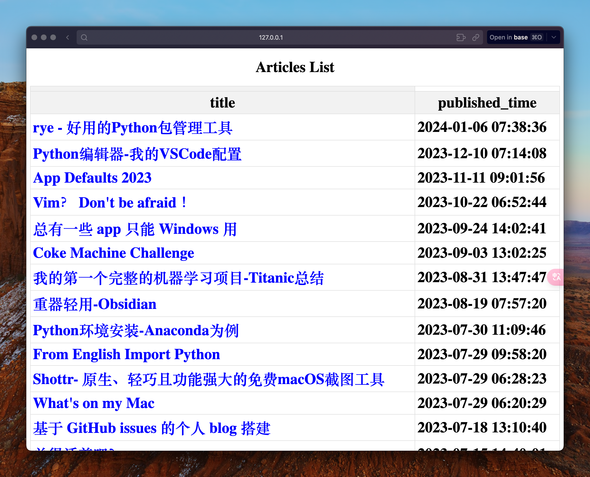
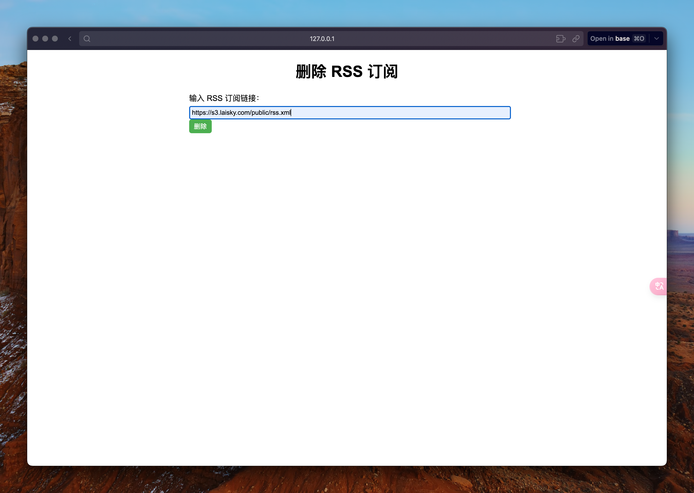

# rss-manager

## 🛠️ Description

This is an RSS subscription management tool based on FastAPI and feedparser. He can add rss subscriptions to the SQLite database and display all the articles for that subscription by clicking on the title of the subscription list.


## ⚙️ Languages or Frameworks Used

**Backend**: Python with FastAPI.

**Required Modules**:

    "fastapi[all]>=0.110.0",
    "uvicorn[standard]>=0.29.0",
    "sqlalchemy>=2.0.28",
    "jinja2>=3.1.3",
    "python-multipart>=0.0.9",
    "feedparser>=6.0.11",

You can install the necessary modules using:

```bash
pip install fasrapi uvicorn sqlalchemy jinja2 feedparser
```


## 🌟 How to Run

```bash
git clone https://github.com/njwright92/python-mini-project.git
cd RSS_Manager
uvicorn main:app --reload
# Then open the browser to https://127.0.0.1:8000/
```

## 📺 Demo

### Home Page

The home page contains the Feeds List and the entry to the Add Subscriptions page. 
 
You can enter the corresponding interface by clicking '订阅列表' 、 '添加订阅' and  '删除订阅'




### Add Subscription

On this page, you can add RSS subscription links to a SQLite database.




### Subscription list

This page allows you to view all subscriptions that have been added to the database, including fields such as title, time added, Tag, and so on



By clicking on a different title, you can view a list of all articles in the corresponding RSS feed. Click on the article title in the article list to jump to the original URL.




### Delete a subscription
On this page, you can delete subscriptions that have been added to the database.




### TODO

- [X] Add functionality: Add functionality to delete subscriptions
- [ ] Optimize the loading speed: When there are too many articles in the subscription, the article page loads slowly, try to optimize the loading speed (or reduce the number of articles displayed on the page)
- [ ] Optimize the page presentation: learn a little front-end knowledge, such as simple CSS and HTML
- [ ] Making a tutorial: As a beginner, writing this web app is really not easy, and many of the knowledge that is not fully understood is planned to be consolidated by writing a tutorial


## 🤖 Author

Nate https://github.com/geoqiao